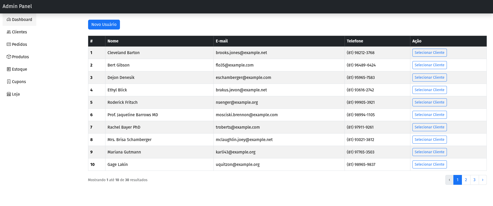
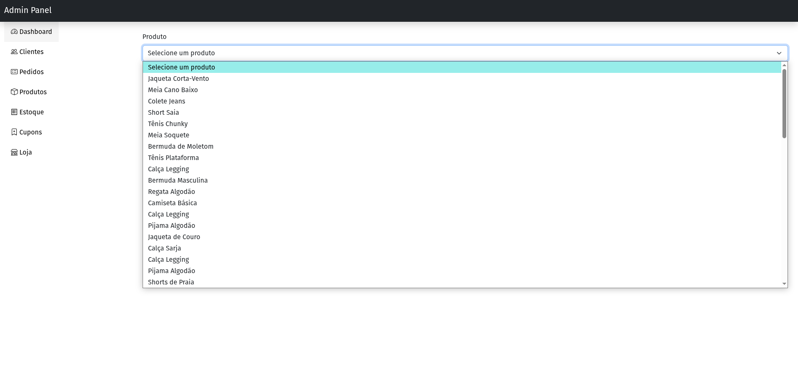
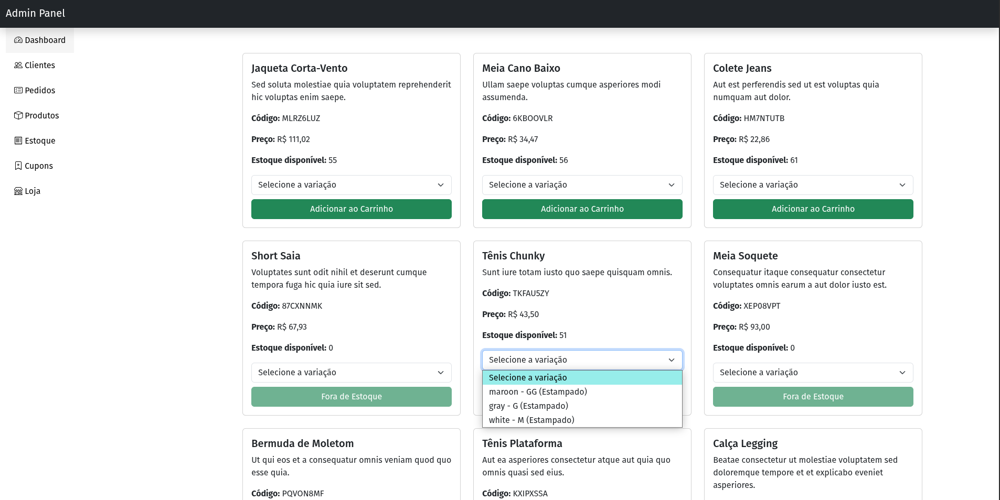
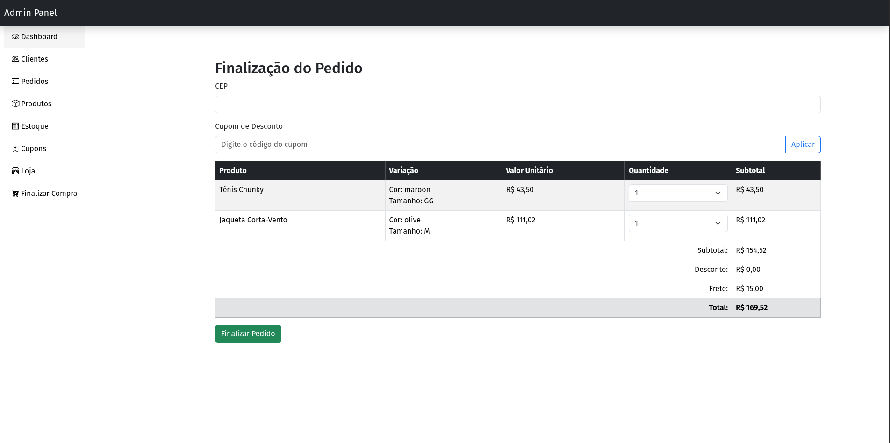
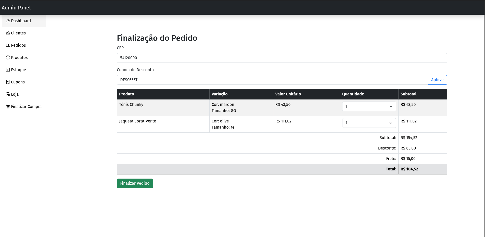
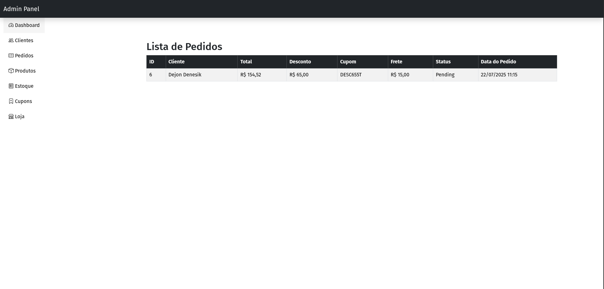
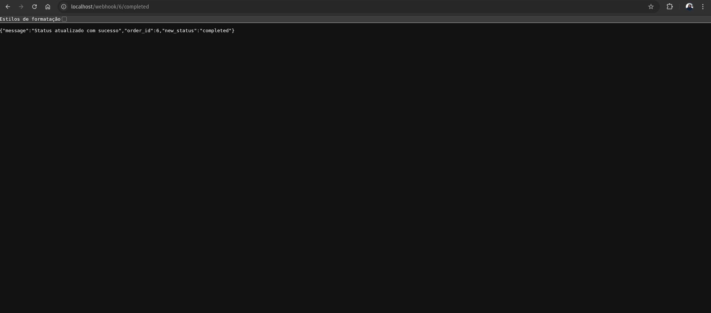
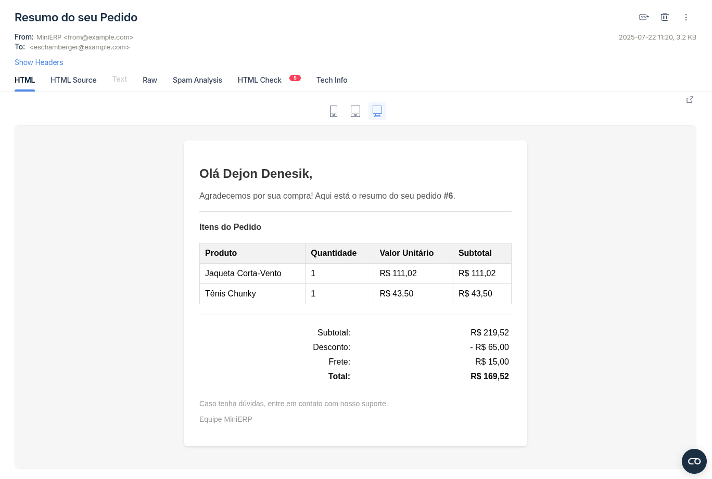

# MiniERP 

## Contexto
Projeto realizado como teste técnico com intuito de criar um ERP com funcionalidades padrão de cadastro de clientes, produtos, estoque, carrinho e checkout, além de Webhook para realizar a devida atualização dos status dos pedidos.

## Técnologias utilizadas

## Como configurar o projeto

Para facilitar instalações e execução do projeto o mesmo está configurado com Docker, bastanto ter o Docker instalado e subir os containers já está com todos os recursos necessários para utilização do projeto.

### Clone o projeto
~~~bash
  git clone git@github.com:RuanSalles/MiniERP.git
~~~

### Renomeie o arquivo .env.example para .env e configure as chaves de ambiente

~~~bash
 
MAIL_MAILER=smtp
MAIL_HOST=
MAIL_PORT=
MAIL_USERNAME=
MAIL_PASSWORD=
MAIL_ENCRYPTION=null
MAIL_FROM_ADDRESS=from@example.com
MAIL_FROM_NAME="MiniERP"
~~~
OBS: As demais configurações já estão realizadas no .env

O projeto utiliza também makefile para facilitar a execução de comandos de configuração e execuções dentro dos containers, então resta apenas executar o comando para subir os containers.

~~~bash

docker compose up -d
docker-compose up -d
~~~

Obs: Dependendo da versão do seu docker e docker-compose, execute  um dos comandos para rodar a inicialização dos containers.

### Baixando dependências, iniciando projeto, populando o banco, configurando chaves da aplicação execute

~~~bash

make init
~~~

Obs: O comando acima já faz a execução da criação da chave de aplicação, roda as migrações e seeds para criar e popular o banco.

#### Para execução efetiva do projeto acesse http://localhost todas as ações estão configuradas visualmente, as únicas tabelas que não são populadas automaticamente, são pedidos e estoque, sendo estoque escolhido pelo usuário a quantidade de produtos já cadastrados e pedidos populada automaticamente ao realizar checkout da compra.

Para executar o início das funcionalidades, clique em Selecionar Cliente, para salvar na sessão o cliente a qual o pedido fará ligação.

No Menu de Estoque, configure o produto e a quantidade desejada

Vá até o menu Loja e inicie a adição de produtos ao carrinho, pondendo ser adicionados produtos que estão com estoque, os que estiverem com a quantidade zero são desabilitados por padrão. Selecione também a variação do produto. 

Ao por ao menos um item no seu carrinhho, será habilitado o Menu na lateral esquerda para *Finalizar Compra*

O sistema automaticamente valida o valor do frete ao preencher o cep para entrega com as regras solicitadas no teste, aplique também cupons para desconto

Por fim finalize a compra e vá até o Menu de pedidos, se o usuário selecionado ainda for o mesmo, você poderá ver seus pedidos

O seu pedido está com o status padrão de pendente, para executar a modificação do status, você poderá executar no seu navegador o link: http://localhost/webhook/{id_pedido}/{status_desejado}, os status permitidos são 'processing', 'completed', 'cancelled'.

Obs: Em caso de enviar o status completed, você receberá um email confirmando sua compra e com o resumo da mesma:

## Da Licença

O projeto foi realizado com intuito de realizar teste técnico porém, poderá ser utilizado por terceiro como método de estudos.
